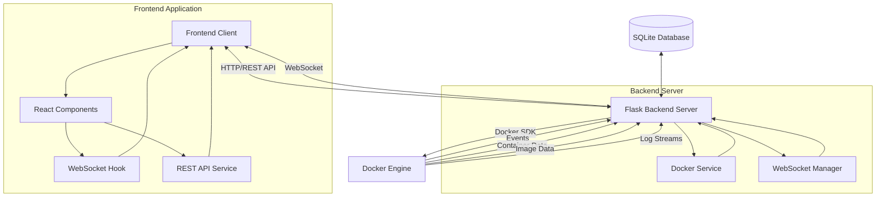
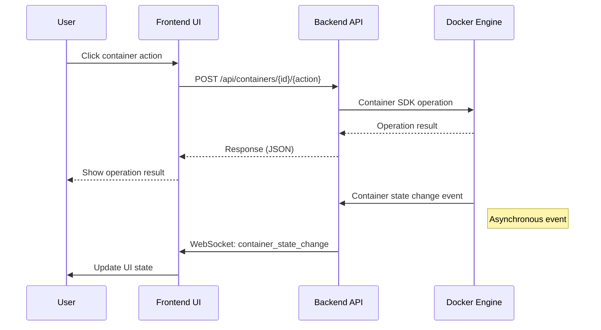
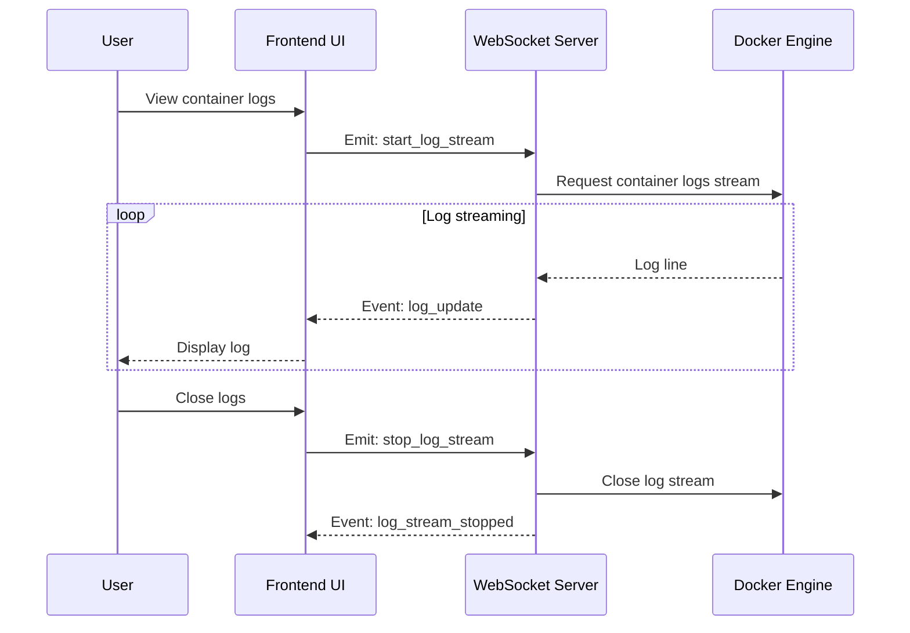
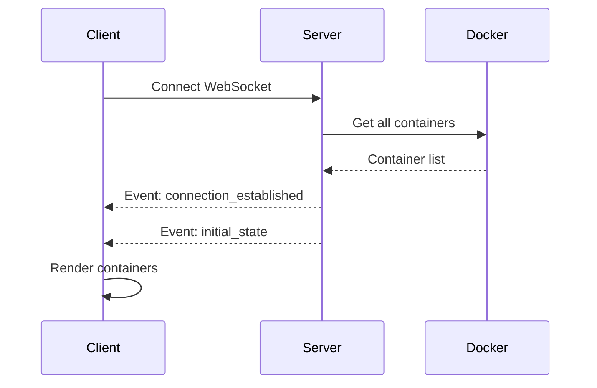
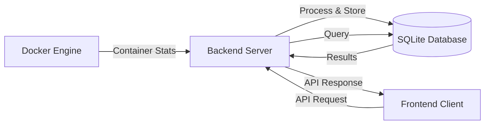
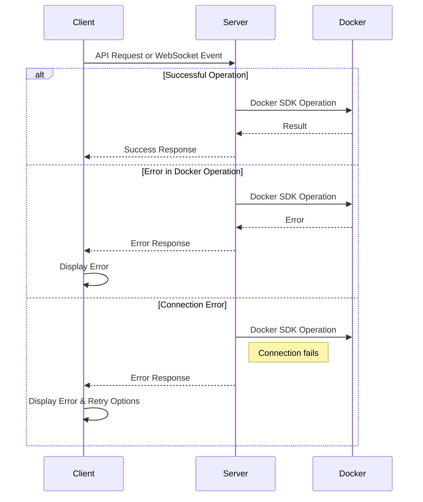
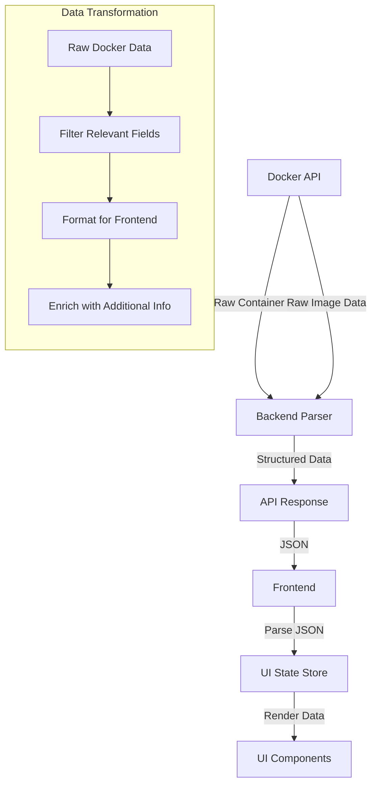
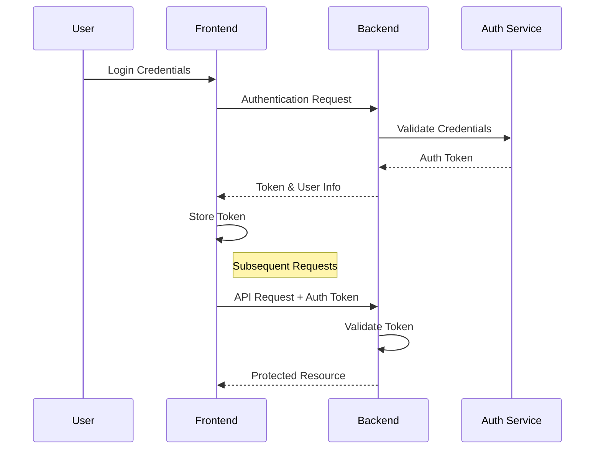

# Application Data Flow

This document details the data flow within the Docker Web Interface application, illustrating how information moves between components.

## Core Data Flow Diagram

## Container Operations Flow

## Log Streaming Flow

## Initial Connection Flow

## Resource Usage Metrics Flow

## Error Handling Flow

## Data Transformation Flow

## Authentication Flow (Future)

