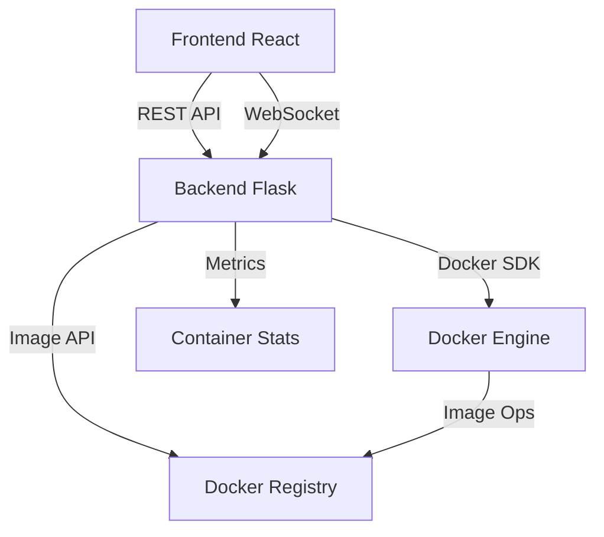

# Docker Web Interface 🐳

## Project Overview 📋

This project is a comprehensive Docker container monitoring and management system that provides a modern web interface for tracking and managing Docker containers in real-time. It combines a React frontend with a Flask backend, featuring built-in logging and monitoring capabilities.

### Key Features

-   Real-time Docker container monitoring
-   Modern React-based web interface
-   RESTful API backend built with Flask
-   Live container log streaming with state persistence
-   Container health monitoring
-   Comprehensive request logging and tracking
-   Persistent UI state across page refreshes
-   Docker image management with tab-based navigation
    -   List and search available images
    -   View detailed image information
    -   Pull and remove images
    -   Image tag management

## To-Do List and Pending Work 📝

-   [ ] Implement real-time container metrics updates
-   [ ] Add container resource usage tracking
-   [ ] Enhance error handling and logging
-   [ ] Optimize backend performance
-   [ ] Add automated testing
-   [ ] Implement container resource limits management
-   [ ] Implement container log search functionality
-   [x] Add Docker image management functionality
-   [x] Implement image management UI with tab navigation

## How the Project Works 🔧

### Architecture Overview

The project consists of two main components:



1. **Frontend React**

    - Modern UI built with React
    - Real-time updates using WebSocket
    - Container management interface
    - Docker image management UI with tab navigation
    - Status visualization

2. **Backend Flask**
    - RESTful API endpoints
    - Docker SDK integration
    - WebSocket server for real-time updates
    - Built-in request logging and monitoring
    - Container metrics collection
    - Docker image management API endpoints

### Component Interaction

The frontend communicates with the backend through REST APIs and WebSocket connections. The backend interfaces with Docker's API to collect container information, manage images, and collect metrics, with comprehensive logging of all operations and requests.

The UI maintains state persistence for:

-   Docker Compose application groups (expanded/collapsed state)
-   Container log views (open/closed state)
-   Log content updates in real-time via WebSocket
-   Image management tab state and filters

This ensures a seamless user experience even after page refreshes or automatic updates.

### Setup Steps

1. Clone the repository:

    ```bash
    git clone <repository-url>
    cd docker-web-interface
    ```

2. Configure environment variables:

    - Copy `.env.example` to `.env`
    - Required environment variables:
        - `FLASK_DEBUG`: Set to 1 for debug mode, 0 for production mode
        - `FLASK_APP`: The main application file (default: docker_monitor.py)
        - `LOG_LEVEL`: Logging level (e.g., INFO, DEBUG)
        - `LOG_FORMAT`: Log format (json or text)
        - `PYTHONPATH`: Python path configuration
        - Other variables as specified in `.env.example`

3. Build and run:
    ```bash
    docker compose up --watch
    ```
