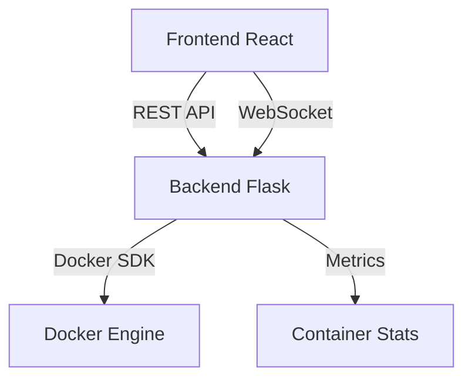

# Docker Web Interface 🐳

## Project Overview 📋

This project is a comprehensive Docker container monitoring and management system that provides a modern web interface for tracking and managing Docker containers in real-time. It combines a React frontend with a Flask backend, featuring built-in logging and monitoring capabilities.

### Key Features

-   Real-time Docker container monitoring
-   Modern React-based web interface
-   RESTful API backend built with Flask
-   Live container log streaming with state persistence
-   Container health monitoring
-   Comprehensive request logging and tracking
-   Persistent UI state across page refreshes

## To-Do List and Pending Work 📝

-   [ ] Implement real-time container metrics updates
-   [ ] Add container resource usage tracking
-   [ ] Enhance error handling and logging
-   [ ] Optimize backend performance
-   [ ] Add automated testing
-   [ ] Implement container resource limits management
-   [ ] Implement container log search functionality

## How the Project Works 🔧

### Architecture Overview

The project consists of two main components:



1. **Frontend React**

    - Modern UI built with React
    - Real-time updates using WebSocket
    - Container management interface
    - Status visualization

2. **Backend Flask**
    - RESTful API endpoints
    - Docker SDK integration
    - WebSocket server for real-time updates
    - Built-in request logging and monitoring
    - Container metrics collection

### Component Interaction

The frontend communicates with the backend through REST APIs and WebSocket connections. The backend interfaces with Docker's API to collect container information and metrics, with comprehensive logging of all operations and requests.

The UI maintains state persistence for:

-   Docker Compose application groups (expanded/collapsed state)
-   Container log views (open/closed state)
-   Log content updates in real-time via WebSocket

This ensures a seamless user experience even after page refreshes or automatic updates.

### Setup Steps

1. Clone the repository:

    ```bash
    git clone <repository-url>
    cd docker-web-interface
    ```

2. Create a .env file with required environment variables:

    ```bash
    # Copy the example environment file
    cp .env.example .env

    # Edit the .env file with your specific values
    nano .env  # or use your preferred editor
    ```

3. Start the application:
    ```bash
    docker compose up --watch
    ```

> ℹ️ **Note:** The application will be available at:
>
> -   Frontend: http://localhost:3002
> -   Backend API: http://localhost:5000

## Notes and Reminders ⚠️

> 💡 **Tips:**
>
> -   All configuration changes should be made through environment variables
> -   Check application logs for monitoring and debugging
