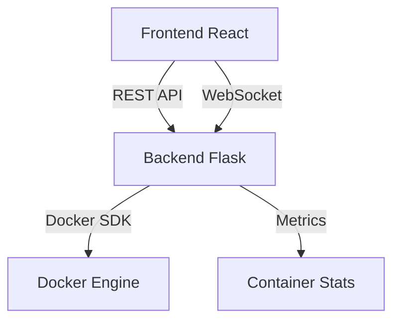

# Docker Web Interface 🐳

## Project Overview 📋

This project is a comprehensive Docker container monitoring and management system that provides a modern web interface for tracking and managing Docker containers in real-time. It combines a React frontend with a Flask backend, featuring built-in logging and monitoring capabilities.

### Key Features

-   Real-time Docker container monitoring
-   Modern React-based web interface
-   RESTful API backend built with Flask
-   Live container log streaming
-   Container health monitoring
-   Comprehensive request logging and tracking

## Current Goals & Objectives 🎯

-   [ ] Implement real-time container metrics updates
-   [ ] Add container resource usage tracking
-   [ ] Enhance error handling and logging
-   [ ] Add container management features (start, stop, restart)
-   [ ] Optimize backend performance
-   [ ] Add automated testing

## How the Project Works 🔧

### Architecture Overview

The project consists of two main components:



1. **Frontend React**

    - Modern UI built with React
    - Real-time updates using WebSocket
    - Container management interface
    - Status visualization

2. **Backend Flask**
    - RESTful API endpoints
    - Docker SDK integration
    - WebSocket server for real-time updates
    - Built-in request logging and monitoring
    - Container metrics collection

### Component Interaction

The frontend communicates with the backend through REST APIs and WebSocket connections. The backend interfaces with Docker's API to collect container information and metrics, with comprehensive logging of all operations and requests.

## Installation and Setup 🚀

### Prerequisites

-   Docker and Docker Compose
-   Node.js (for local development)
-   Python 3.8+ (for local development)

### Setup Steps

1. Clone the repository:

    ```bash
    git clone <repository-url>
    cd docker-web-interface
    ```

2. Create a .env file with required environment variables:

    ```bash
    # Copy the example environment file
    cp .env.example .env

    # Edit the .env file with your specific values
    nano .env  # or use your preferred editor
    ```

3. Start the application:
    ```bash
    docker compose up --watch
    ```

> ℹ️ **Note:** The application will be available at:
>
> -   Frontend: http://localhost:3002
> -   Backend API: http://localhost:5000

## To-Do List and Pending Work 📝

### High Priority

-   [ ] Implement container resource limits management
-   [ ] Add user authentication and authorization
-   [ ] Create comprehensive API documentation

### Medium Priority

-   [ ] Add support for Docker Swarm
-   [ ] Implement container log search functionality
-   [ ] Create backup and restore functionality

### Low Priority

-   [ ] Add dark mode support
-   [ ] Implement container templates
-   [ ] Add support for custom metrics

## Documentation for Developers 👩‍💻

### API Endpoints

-   GET /api/containers - List all containers
-   GET /api/containers/{id} - Get container details
-   GET /api/containers/{id}/logs - Get container logs
-   WS /api/ws - WebSocket endpoint for real-time updates

### Development Guidelines

1. Follow the established code style
2. Write unit tests for new features
3. Update documentation for API changes
4. Use feature branches for development

### Local Development

1. Start backend:

    ```bash
    cd backend
    pip install -r requirements.txt
    flask run
    ```

2. Start frontend:
    ```bash
    cd frontend
    npm install
    npm start
    ```

## Notes and Reminders ⚠️

> 🚨 **Warning:** The application is currently being monitored using `docker compose up --watch`. Do not restart services manually as it will interfere with the monitoring process.

> 💡 **Tips:**
>
> -   All configuration changes should be made through environment variables
> -   Check application logs for monitoring and debugging

---

For any questions or issues, please open a GitHub issue or contact the maintainers.
