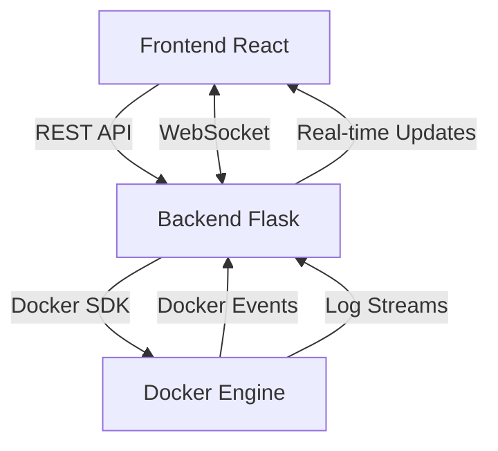

# Docker Web Interface 🐳

## Overview

Docker Web Interface is a comprehensive system for monitoring and managing Docker containers and images in real-time. It provides a modern, responsive web interface built with React and a robust Flask backend. The platform supports live container log streaming, Docker image management, and Docker Compose project grouping, all while offering enhanced logging and request tracing.

## Key Features

-   **Real-time Container Monitoring**
    -   Receive live updates via WebSocket as container states change.
-   **Modern Web Interface**
    -   Intuitive React-based UI with simplified styling.
    -   Enhanced port visualization with clear host-to-container mapping and protocol tooltips.
    -   Keyboard shortcuts for quick navigation and actions.
    -   Command palette for quick search access (Ctrl+K).
    -   Dark and light mode support with system preference detection and persistent user preference.
-   **RESTful API Backend**
    -   Flask-powered endpoints to manage containers and images.
-   **Live Log Streaming**
    -   View container logs in real-time with persistent state across sessions.
    -   Auto-scrolling functionality that follows new log entries as they arrive.
    -   Ability to pause auto-scrolling when manually scrolling up through logs.
    -   "Follow Logs" button to resume auto-scrolling when paused.
    -   Continuous streaming of logs as they are generated by the container.
-   **Docker Image Management**
    -   List, search, and view images through the dedicated UI.
    -   Delete images (with force option for images used by containers).
    -   Direct links to Docker Hub or registry source for each image.
-   **Docker Compose Project Grouping**
    -   Automatically group containers by Docker Compose projects and perform bulk actions (start, stop, restart).
-   **Enhanced Logging and Request Tracing**
    -   Comprehensive logging with unique request IDs for improved traceability.
-   **State Persistence**
    -   Maintains active tab selections, group expansion states, and log view settings between sessions.
    -   Remembers user's theme preference (dark/light mode) across sessions.
-   **Unit Testing**
    -   Comprehensive test suite for backend services using pytest.
    -   Mocked Docker client for reliable, reproducible tests.

## Architecture

### System Components

1. **Frontend (React)**

    - Communicates with the backend via REST API and WebSocket.
    - Provides an interactive interface for container and image management.

2. **Backend (Flask)**
    - Offers RESTful API endpoints and a WebSocket server.
    - Integrates with the Docker Engine using the Docker SDK to manage containers and images.
    - Handles log streaming and emits container state changes in real time.

### Architecture Diagram




## Installation and Setup

### Prerequisites

-   Docker and Docker Compose installed on your system
-   Git for cloning the repository

### Quick Start

1. **Clone the Repository:**

    ```bash
    git clone https://github.com/kik369/docker-web-interface.git
    cd docker-web-interface
    ```

2. **Configure Environment Variables:**

    - Copy `.env.example` to `.env`
    - Edit the file to set the following variables as needed:
        - `FLASK_DEBUG` (set to 1 for debug mode, 0 for production)
        - `FLASK_APP` (default: `docker_monitor.py`)
        - `LOG_LEVEL` (e.g., `INFO`, `DEBUG`)
        - `LOG_FORMAT` (`json` or `text`)
        - `PYTHONPATH` (default: `/app`)
        - Other variables as specified in `.env.example`

3. **Build and Run with Docker Compose:**

    ```bash
    docker compose up --build
    ```

    This will:

    - Build the frontend and backend containers
    - Start the application stack
    - Make the interface available at http://localhost:3002

4. **Access the Application:**

    Open your browser and navigate to:

    - Web Interface: http://localhost:3002
    - API Endpoints: http://localhost:5000/api

> 💡 **Tip:** Use `docker compose up -d` to run in detached mode, and `docker compose logs -f` to view logs.

### Development and Testing

The project includes a comprehensive test suite for the backend services. To run tests:

```bash
# Inside the backend container
docker compose exec backend pytest -v

# With coverage report
docker compose exec backend pytest --cov=backend --cov-report=term
```

To run pre-commit hooks (requires running inside the container):

```bash
docker compose exec backend pre-commit run --all-files
```

## Testing

The project includes a comprehensive test suite for the backend services:

### Running Tests

To run all tests with verbose output:

```bash
cd backend
python -m pytest -v
```

To check test coverage for the entire backend:

```bash
python -m pytest --cov=backend --cov-report=term
```

To run all pre-commit hooks manually:

```bash
pre-commit run --all-files
```

### Pre-commit Hooks

The project uses pre-commit hooks to ensure code quality. The hooks are configured in `.pre-commit-config.yaml` and include running pytest with coverage reports.

To install pre-commit hooks:

```bash
pip install pre-commit
pre-commit install
```

The pre-commit hook will run pytest with coverage for backend code automatically before each commit.

### Test Structure

-   Tests are organized in the `backend/tests` directory
-   Unit tests use pytest fixtures to mock the Docker client
-   Key functionality tested includes:
    -   Container operations (get, start, stop, restart, delete)
    -   Container log retrieval
    -   Image operations (get, delete)
    -   Helper methods and error handling
    -   WebSocket connections and event handling
    -   Rate limiting functionality
    -   Docker event subscriptions

## Developer Documentation

-   **Backend:** Built with Flask and Gunicorn. Core modules include:

    -   `docker_monitor.py` – Application setup and WebSocket integration.
    -   `docker_service.py` – Interfacing with Docker Engine for container and image operations.
    -   `logging_utils.py` – Utilities for structured logging and request ID tracking.
    -   `config.py` – Configuration management and validation.

-   **Frontend:** Developed in React with TypeScript. The UI leverages WebSocket for real-time updates and includes dedicated components for container and image management.

    -   Components are organized in the `src/components` directory
    -   Custom hooks in `src/hooks` handle data fetching and WebSocket integration
    -   Context API for state management in `src/context`
    -   Types defined in `src/types`

-   **Keyboard Shortcuts:** The application provides keyboard shortcuts for quick navigation and access to features:

    -   `Ctrl + K` – Open command palette (central interface for search and commands)
    -   `Ctrl + Shift + C` – Switch to Containers tab
    -   `Ctrl + Shift + I` – Switch to Images tab
    -   `Ctrl + D` – Toggle dark/light mode
    -   `Ctrl + R` – Refresh current view

-   **Command Palette:** The application features a powerful command palette (activated with `Ctrl + K`) that provides:

    -   Quick access to all application commands
    -   Search functionality for containers and images
    -   Keyboard navigation with arrow keys
    -   Command categorization for easy discovery
    -   Shortcut hints for frequently used commands

-   **WebSocket Architecture**: The application uses a robust WebSocket implementation for real-time updates:

    -   Backend implemented with Flask-SocketIO
    -   Frontend uses a custom React hook with the Socket.IO client
    -   Efficient log streaming with buffering system
    -   Proper resource cleanup and connection management

-   **Data Flow**: The application follows a clear data flow pattern:

    -   Core data flow between system components
    -   Container operations sequence
    -   Log streaming process
    -   Error handling flow

-   **Logging:** Implemented using Python's logging module with custom JSON formatting and request ID tracking, ensuring detailed monitoring and debugging.

-   **Testing:** Unit tests implemented with pytest, using mocking to isolate components and ensure reliable test results.

## Additional Notes

-   The Docker socket is mounted into the backend container to enable direct communication with the Docker Engine.
-   Future updates will include detailed container metrics and enhanced resource monitoring features.
-   The frontend uses Tailwind CSS for styling.
-   The application supports both production and development environments through the `.env` configuration.
